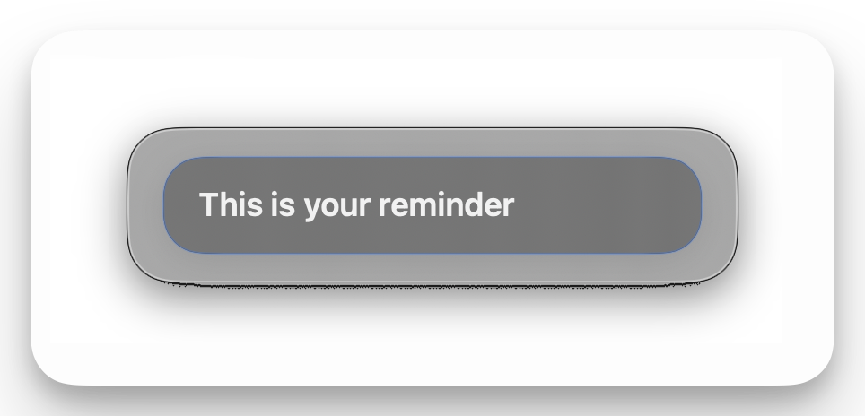

# TaskLock

A minimalist macOS focus reminder that stays on top and gently pulses to pull you back.



## Features
- Floating always-on-top note window across Spaces
- Editable focus text with quick commit (Return)
- Pulse reminders with adjustable interval, intensity, and screen range
- Optional sound cue per pulse (including "None")
- Menu bar toggle for show/hide

## Requirements
- macOS 15+
- Swift 6.2+

## Run
```bash
swift run TaskLock
```

## Build
```bash
swift build -c release
```

## Tips
- Click the note to edit; press Return to commit (Shift+Return inserts a newline).
- Set Pulse Intensity to 0% to disable pulses entirely.

## Project Layout
- `Sources/TaskLockApp` - app code
- `Sources/sound_effects` - bundled MP3s
- `assets/` - README images
